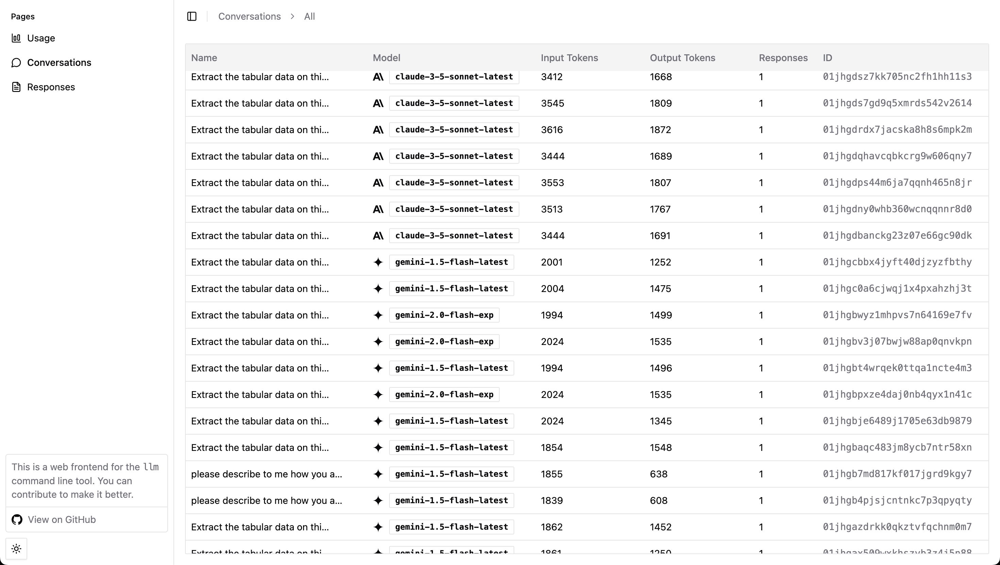

# LLM Web UI

A web frontend for the [llm](https://github.com/simonw/llm) command line tool.

## Usage

```sh
npx -y llm-web-ui $(llm logs path)
```

### Conversations List


### Responses Stream


## Development

```sh
bun run dev
```